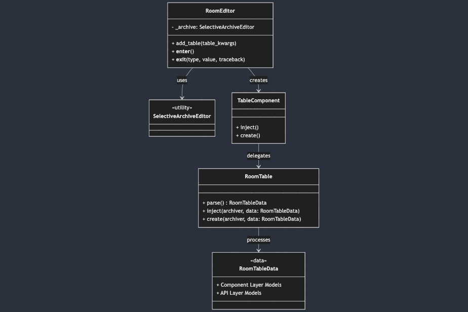
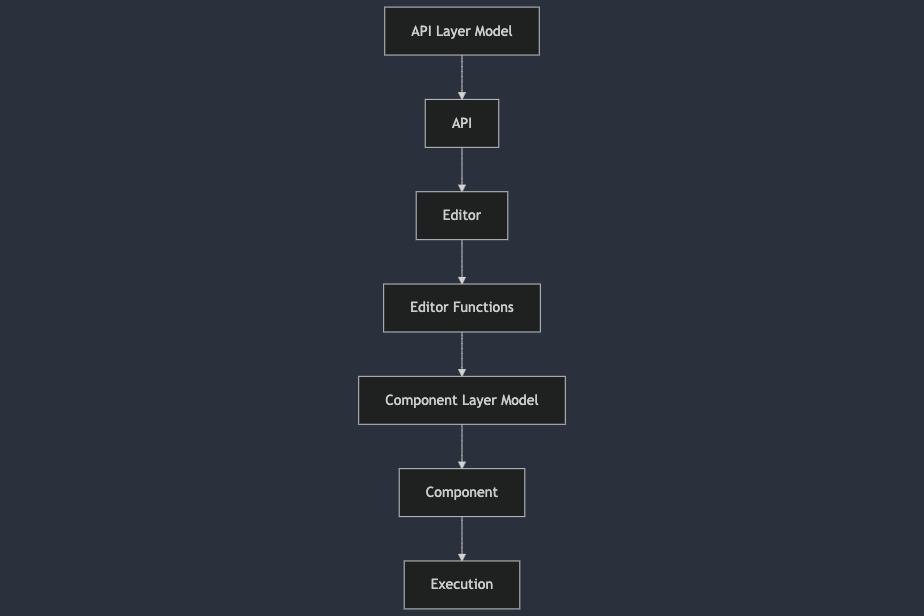

# Document Manipulator

Document Manipulator is a powerful tool designed for high-speed modification of the XML and binary code within Word documents, PowerPoint presentations, PDF files, and more. It enables seamless addition of comments, sections, text, shapes, images, and other elements, offering unparalleled efficiency and flexibility for document customization and automation.

---

### Example Usages

PresentationEditor:
```python
with PresentationEditor("absolute_file_path") as editor:  # absolute_file_path is optional, you can include it or the origin presentation bytes.
  editor.get_slide(slide_index).comment(...)
  new_presentation_bytes = editor.export(absolute_export_path)  # absolute_export_path is optional
```

SelectiveArchiveEditor:
```python
with SelectiveArchiveEditor("absolute_file_path") as editor:  # absolute_file_path is optional, you can include it or the origin file bytes.
  new_file_bytes = editor.upsert(...).upsert_many(...).export(absolute_file_path)  absolute_export_path is optional
```

DocumentEditor:
```python
with DocumentEditor(FILE_PATH/BYTES) as editor:
    editor.add_comment("Text to Highlight", DocCommentData(FILL WITH COMMENT INFO))  # It will automatically look for the text in all pages, as the structure of docx does not specify pages.
    new_document_bytes = editor.export
```

---

### Installation

1) Install Poetry

`pip install poetry`

2) Create a Poetry Environment

`poetry shell`

3) Install Dependencies

`poetry install`

4) Use the tool's capabilities as shown per the Example Usages above.

`with PresentationEditor(...) as editor: ...`

---

### Coding Standards & Style

The project is organized into four distinct sections, each with a specific purpose:

- **Editors**: Serve as the entry point for tool usage. Editors utilize components to perform their operations but do not contain any XML logic themselves. They act as facades.
- **Components**: Handle all XML operations, including parsing, injecting, and creating XML files or elements.
- **Data**: Stores the necessary data structures and models required by both editors and components.
- **Tools**: Provides utility functions and classes that support the operations of the other three sections.

#### Example Structure

```python
class RoomEditor:
    """Editors should not contain ANY XML code; they are purely facades."""

    def __init__(self, ...):
        self._archive: SelectiveArchiveEditor = SelectiveArchiveEditor()
    
    def add_table(table_kwargs...): 
        """
        Adds a table by creating and injecting the necessary XML. This method does not take a model, 
        as the model will be handled by the endpoints.
        """
        table_component = TableComponent(**table_kwargs)
        table_component.inject()  # Use inject to insert XML into a pre-existing XML file.
        # If the component is not injectable, use .create()
        # If both inject and create are possible, inject should fallback to create if necessary.

    def __enter__(self):
        return self

    def __exit__(self, type, value, traceback):  # noqa
        self._archive.close()
    

class RoomTable(ParsedArchiveFile):
    """Component class that contains all the necessary XML logic."""

    def parse(self) -> RoomTableData:
        """Reads the data of the table and populates the RoomTableData."""
        
    def inject(self, archiver, data: RoomTableData):
        """
        Creates the necessary XML for the RoomTableData and inserts it into a pre-existing XML file.
        Falls back to create if the file does not exist.
        """
        
    def create(self, archiver, data: RoomTableData):
        """Creates the necessary file for the component."""
    

class RoomTableData(XMLFileData):
    """
    Contains the component data to be inserted or retrieved.
    
    Guidelines:
    - Maintain two layers of models:
      1. **Component Layer Models**: Like this one, passed around by editors.
      2. **API Layer Models**: Designed to be set by the APIs.
    """
```

#### Example Structure Diagram


---

### Projected Operational Flow

The operational flow of the project can be visualized as follows:

